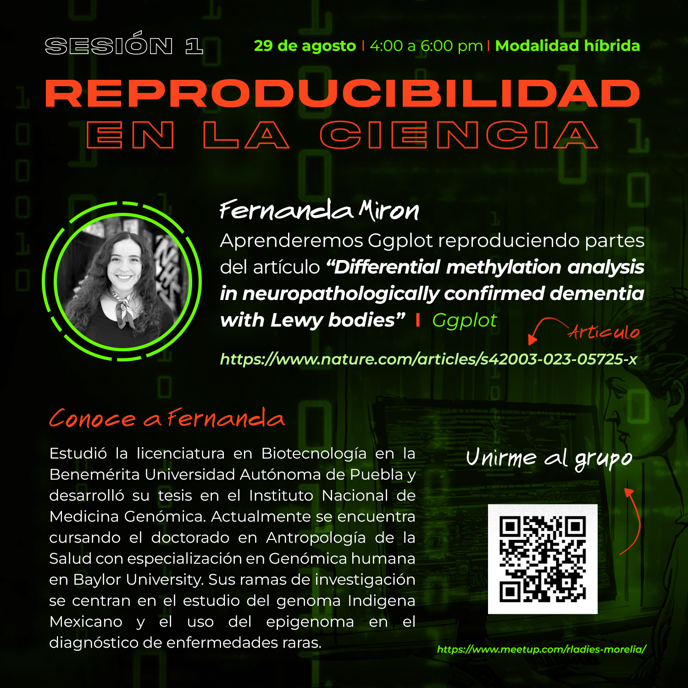
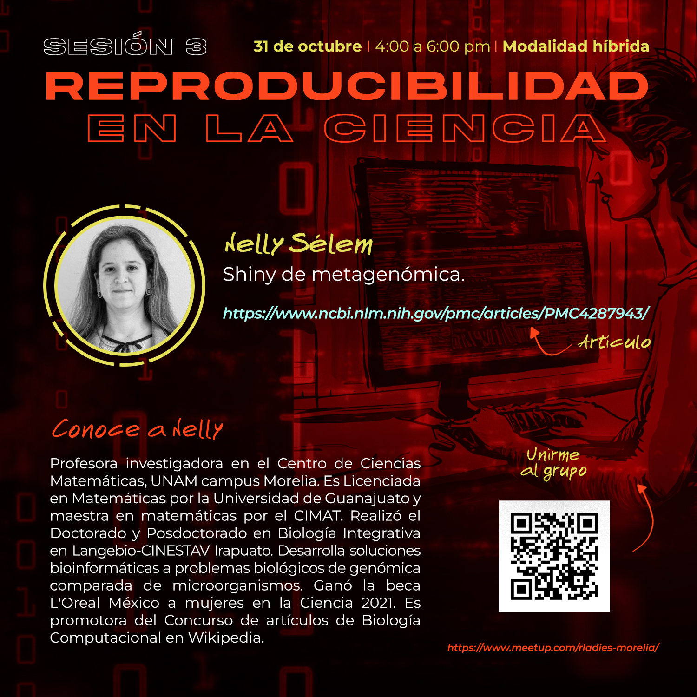

# Reprohack 2024

Edición 2024 💜, Rladies Morelia

⭐ Objetivo: Analizar artículos científicos reproducibles en Biología computacional / Bioinformática.

Descripción: En este semestre aprenderemos paquetes de R mediante la reproducción de algunas figuras de artículos científicos interesantes.

## Información sobre horarios

- Horario: 4- 6 pm CDMX (GMT-6).
- Número de sesiones: 4
- Clases híbridas en:
  -  Aula en CCM, Morelia
  -  Zoom
- Grabación de las sesiones 📹.

## Inscripción

Los cursos se imparten el último JUEVES de cada mes (agosto-noviembre), se les pide que se inscriban a través de [meetup](https://www.meetup.com/es-ES/rladies-morelia/) a las sesiones.

Gracias por hacer de nuestro grupo un lugar especial. ¡Espero que sigamos logrando grandes cosas juntas!

## Instructores 👾

- Maria Fernanda Miron Toruno - estudiante de doctorado, Baylor University
- Amairani Cancino Bello - estudiante de doctorado, CINVESTAV
- Maria Jose Palma Martinez - estudiante de doctorado, Centro de Ciencias Genómicas de la UNAM.
- Evelia Lorena Coss Navarrete - Posdoctoral, LIIGH-UNAM
- Nelly Sélem Mojica - Profesora investigadora, Ciencias Matemáticas de la UNAM.
- Aline Pingarroni - Profesora investigadora, FES-Iztacala

## Contenido 📌

Clases: jueves de 4 -6 pm (GMT-6)

- **Grupo 1: ggplot reproduciendo algunas figuras del artículo**
  * Artículo: [Differential methylation analysis in neuropathologically confirmed dementia with Lewy bodies](https://www.nature.com/articles/s42003-023-05725-x )
  * Fecha: jueves 29 de agosto
  * Líder de grupo: Maria Fernanda Miron Toruno
  * Integrantes: Erika Cruz, Liz, Sofia
  * Repositorio: [Grupo 1](https://github.com/R-Ladies-Morelia/Reprohack2024/tree/main/Grupo1)
  * Video: [Video Grupo 1](https://drive.google.com/file/d/1Cf01kp7e59tj1A7_HwNkBQgitBEj26P6/view?usp=sharing)
  * [Meet up](https://www.meetup.com/rladies-morelia/events/302577360/?utm_medium=referral&utm_campaign=share-btn_savedevents_share_modal&utm_source=link)

- **Grupo 2: ggplot y variantes geneticas**
  * Artículo: [Historical Contingency Drives Compensatory Evolution and Rare Reversal of Phage Resistance](https://academic.oup.com/mbe/article/39/9/msac182/6673247?login=false#371728839)
  * Fecha: jueves 26 de septiembre
  * Líderes de grupo: Amairani Cancino Bello, María José Palma Martínez y Evelia Coss.
  * [Meet up](https://www.meetup.com/rladies-morelia/events/302577407/?utm_medium=referral&utm_campaign=share-btn_savedevents_share_modal&utm_source=link)

- **Grupo 3: Shiny app**
  * Artículo: [Shiny-phyloseq: Web application for interactive microbiome analysis with provenance tracking](https://www.ncbi.nlm.nih.gov/pmc/articles/PMC4287943/)
  * Fecha: jueves 31 de octubre
  * Líderes de grupo: Nelly Sélem Mojica
  * [Meet up](https://www.meetup.com/rladies-morelia/events/302577493/?utm_medium=referral&utm_campaign=share-btn_savedevents_share_modal&utm_source=link)

- **Grupo 4: ggplot y biodiversidad**
  * Artículo: [Mapping the planet’s critical natural assets](https://www.nature.com/articles/s41559-022-01934-5)
  * Fecha: jueves 28 de noviembre
  * Líderes de grupo: Aline Pingarroni
  * [Meet up](https://www.meetup.com/rladies-morelia/events/302618901/?utm_medium=referral&utm_campaign=share-btn_savedevents_share_modal&utm_source=link)

-----------------------------
Cursos hechos con amor 💜
